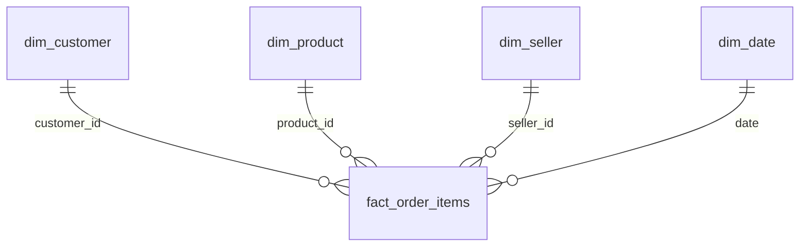

# Warehouse Design

> Dimensional model (star schema) for the analytics warehouse.

## Table of Contents

- [Overview](#overview)
- [Fact Table](#fact-table)
- [Dimension Tables](#dimension-tables)
- [Star Schema](#star-schema)
- [Planned Metrics](#planned-metrics)
- [Future Enhancements](#future-enhancements)

---

## Overview

The analytics warehouse is designed using a **dimensional model (star schema)**. This approach separates measurable business events (**facts**) from descriptive business entities (**dimensions**), making analytical queries simpler, faster, and easier to maintain.

---

## Fact Table

### `fact_order_items`

| | |
|---|---|
| **Grain** | One row represents a single product purchased within an order. |
| **Why this table** | Captures the core business event — the sale of a product. |

Choosing the order-item grain (rather than the order grain) enables analysis of:

- Revenue
- Product sales
- Seller performance
- Freight costs
- Order volumes
- Customer purchasing behaviour

> Using `orders` as the fact table would give one row per order, but would lose product-level detail — making product and seller analytics harder.

---

## Dimension Tables

| Table | Business Entity | Key | Purpose |
|---|---|---|---|
| `dim_customer` | Customer | `customer_id` | Customer attributes for analysing purchasing behaviour by customer and location. |
| `dim_product` | Product | `product_id` | Descriptive product info — category, weight, dimensions. |
| `dim_seller` | Seller | `seller_id` | Seller info for analysing sales performance and order fulfilment. |
| `dim_date` | Calendar Date | `date` | Supports time-based analysis: daily sales, monthly revenue, quarterly trends, YoY comparisons. |
| `dim_geography` *(optional)* | Location | Zip code prefix | Enables geographical analysis of customers and sellers. |

---

## Star Schema

---

## Planned Metrics

| Metric | Description | Status |
|---|---|---|
| Total Revenue | | 🔲 Not started |
| Order Count | | 🔲 Not started |
| Average Order Value | | 🔲 Not started |
| Average Delivery Time | | 🔲 Not started |
| Customer Lifetime Value | | 🔲 Not started |
| Repeat Customer Rate | | 🔲 Not started |
| Top Product Categories | | 🔲 Not started |
| Seller Revenue | | 🔲 Not started |
| Average Review Score | | 🔲 Not started |

---

## Future Enhancements

- [ ] Additional fact tables (Payments, Reviews)
- [ ] Slowly Changing Dimensions (SCD)
- [ ] dbt tests and documentation
- [ ] Semantic / business metrics layer
- [ ] AI-powered natural language analytics